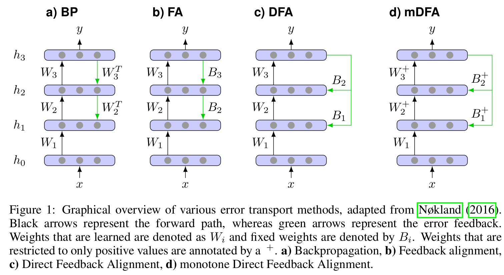

# Code repository of **Learning representations for binary-classification without backpropagation**

## Overview

|  | |
| --- | --- |
| **Title** | Learning representations for binary-classification without backpropagation |
| **Conference** | ICLR 2020 (Poster) | 
| **PDF** | [Link](https://openreview.net/pdf?id=Bke61krFvS) |
| **openreview submission** | [Link](https://openreview.net/forum?id=Bke61krFvS)  |




## Requirements 

Requires python3 and TensorFlow 1.x (tested with 1.14.0)

To create a new virtual python3 environment run
```bash
python3 -m venv mdfa_env
source mdfa_env/bin/activate
pip3 install tensorflow-gpu==1.14.0
```

## Module descriptions:

- ```fa_model.py```: Implementation of BP, FA, DFA and mDFA for fully-conncted network architectures
- ```fa_convnet.py```: Implementation of BP, FA, DFA and mDFA for *all-convolutional-network* architectures
- ```train_model.py```: Main file for training a network on MNIST, CIFAR-10 or CIFAR-100
- ```train_imagenet.py```: Main file for training a network on ImageNet
- ```init_parser.py```: Parser for the weight initialization string given by the program arguments
- ```imagenet_iterator.py```: Utility for processing ImageNet data

## Examples

Training a fully-connected network using mDFA on 5-class CIFAR-10:

```bash
python3 train_model.py --dataset cifar10 --classes 5 --model mdfa 
```

Training a convnet using backpropagation on 2-class CIFAR-100:

```bash
python3 train_model.py --dataset cifar100 --classes 2 --model bp --convnet
```

## Weight initialization

Weight intialization can be control by the following arguments:
```bash
--forward_init 0
    # Initalizes forward weights by all zeros

--backward_init U1
    # Initalizes backward weights using a symmetric uniform distrbution inversely scaled by the square-root of the number of incomming connections

--forward_init N0.1
--backward_init N0.1
    # Initalizes forward and backward weights using a normal distribution scaled by 0.1
```

Note that the ```--backward_init``` will be ignored if the network if trained by backpropagation

Weight initialization for mDFA will be automatically adapted to the weight constraints.
For instance, the ```--forward_init N0.1``` argument for mDFA will be translated into the absolute normal distrubution as discussed in the paper. (Likewise, the lower bound for ```--forward_init U1``` will be set to a small epsilon)

## Weight constraints for mDFA

Weight constraints for mDFA are implemented through a set of clipping operations that are applied after each parameter update, i.e.,

```python
w = mDFA_update(w)
w = maximum(w,0)
```

For more details see ```fa_model.py``` lines 265-271 and 409-417.

## Bibtex

```tex
@inproceedings{
    lechner2020learning,
    title={Learning representations for binary-classification without backpropagation},
    author={Mathias Lechner},
    booktitle={International Conference on Learning Representations},
    year={2020},
    url={https://openreview.net/forum?id=Bke61krFvS}
}
```